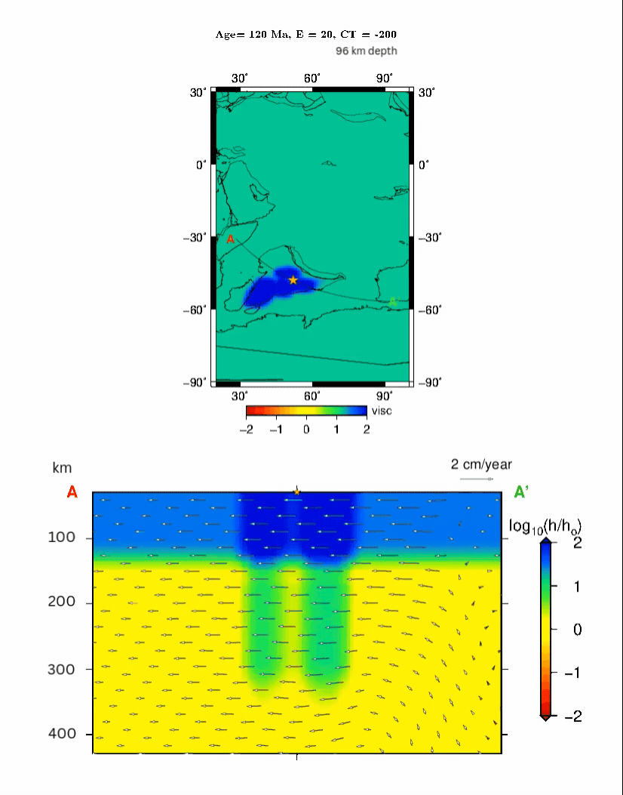

# 🌋 CitcomS Plume–Plate Interaction Modeling

This repository presents a computational geodynamics project focused on plume–plate interaction using the CitcomS geodynamic modeling framework.

The project investigates the interaction between mantle plumes and moving tectonic plates, with particular emphasis on the Indian plate and plume systems including the Kerguelen, Marion, and Reunion plumes. Numerical simulations are used to study mantle flow evolution, lithospheric deformation, craton stability, and thermo-mechanical mantle dynamics over geological timescales.

  

The repository highlights:
- Mantle plume evolution
- Plume–lithosphere interaction
- Indian plate motion
- Craton deformation
- Thermo-mechanical numerical modeling
- Scientific visualization and interpretation
- Computational geodynamics workflows
